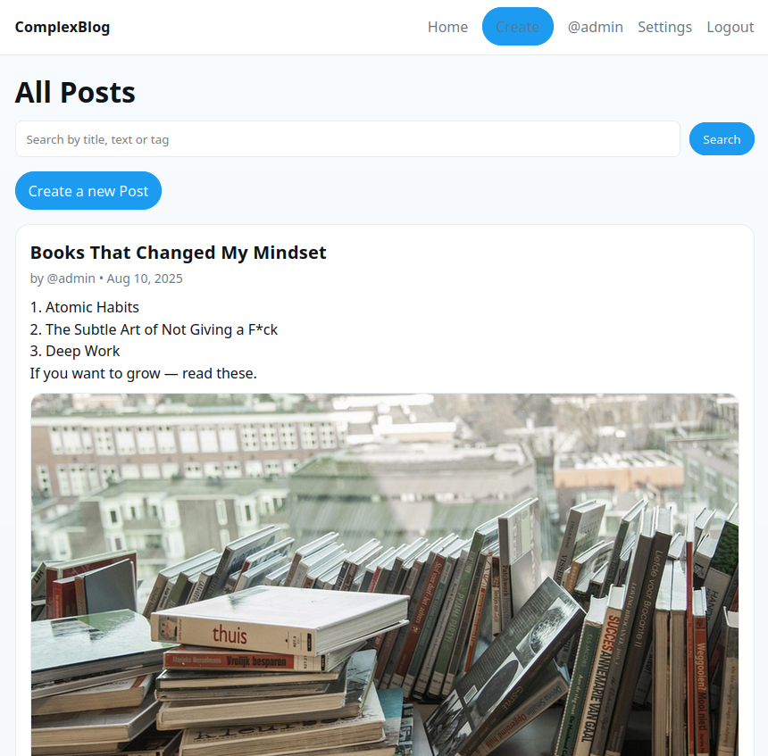
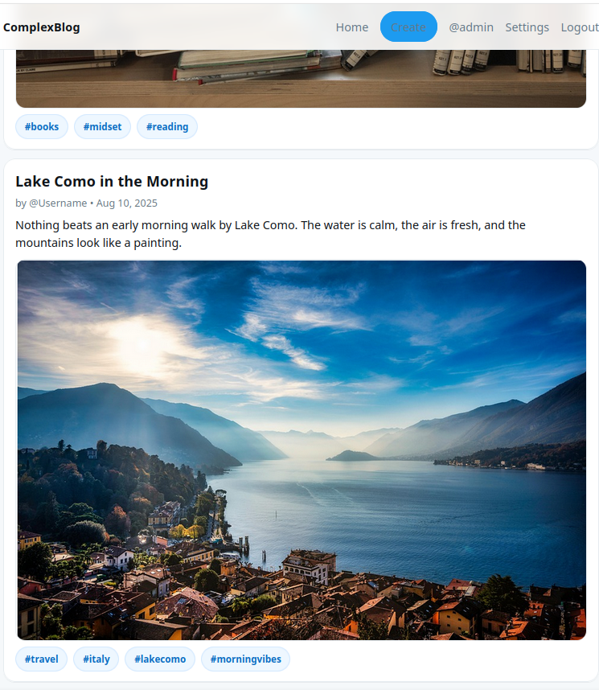
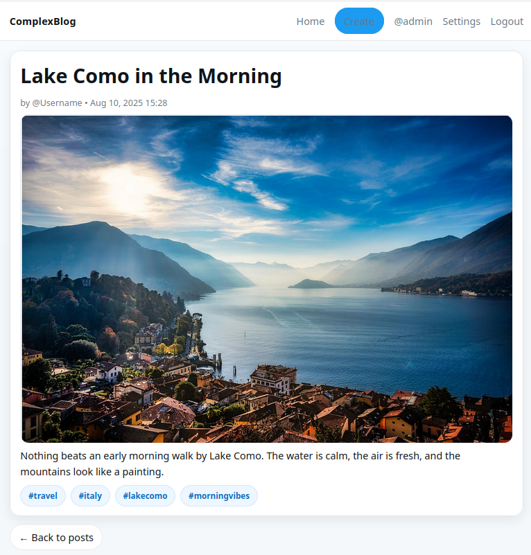
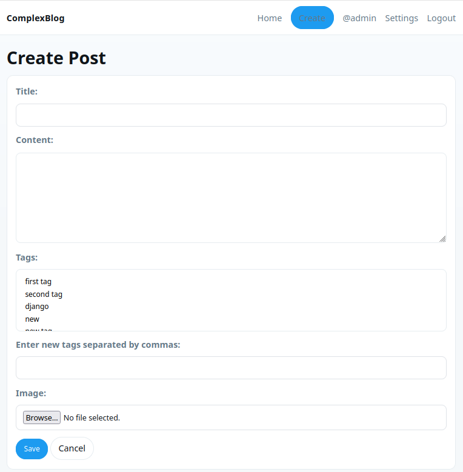
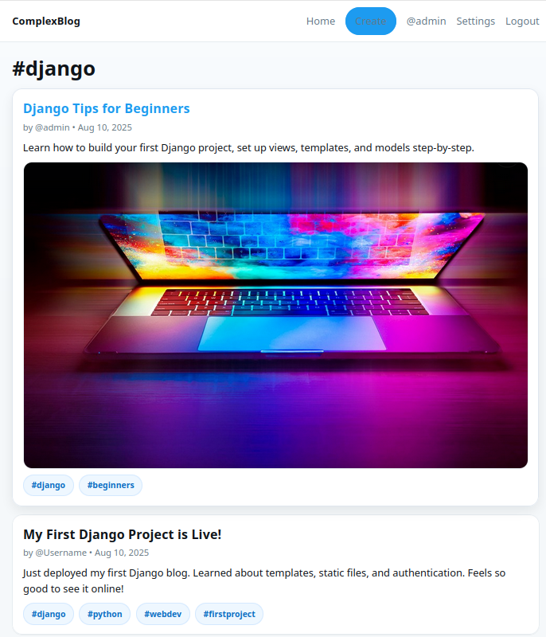
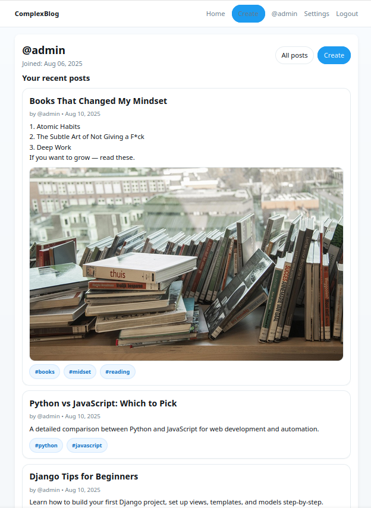

# ComplexBlogProject

A minimal Twitter-like blog built with **Django**.  
Features: posts with optional images, tags, search, infinite scroll, auth, profile page, and a simple Settings screen with inline password change.

---

## 📸 Screenshots

### Home / Timeline



  
### Post detail
  


### Create post
  


### Posts by tag
  


### Profile
  

---

## 🧰 Tech Stack

- Python 3.x, Django 4.x
- HTML, CSS, a tiny bit of vanilla JS (fetch + IntersectionObserver)
- SQLite (default for dev)
- Pillow (image uploads)

---

## ✨ Features

- Create / edit / delete posts
- Optional **image** per post
- **Tags** (Many-to-Many) + filter by tag
- **Search** (`q`) across title, content, tag name, and author username
- **Infinite scroll** (AJAX fragment endpoint returns HTML)
- **Auth**: register / login / logout / profile
- **Settings** page with inline password change
- **Caching** for anonymous users to speed up timeline


---

## 🚀 Getting Started

```bash


git clone https://github.com/<your-user>/ComplexBlogProject.git
cd ComplexBlogProject

# Create & activate venv (Linux/macOS)
python3 -m venv .venv && source .venv/bin/activate
# Windows: py -m venv .venv && .venv\Scripts\activate

pip install -r requirements.txt
# If you don't have a requirements.txt yet:
# pip install django pillow

python manage.py migrate
python manage.py createsuperuser
python manage.py runserver

```

---

## ⚙️ Configuration (static & media)

**In settings.py make sure you have:**

```commandline
# Static
STATIC_URL = '/static/'

# Media (for uploaded post images)
MEDIA_URL = '/media/'
MEDIA_ROOT = BASE_DIR / 'media'

```

**In your project urls.py (root):**

```commandline
from django.conf import settings
from django.conf.urls.static import static

urlpatterns = [
    # ... your routes ...
]

if settings.DEBUG:
    urlpatterns += static(settings.MEDIA_URL, document_root=settings.MEDIA_ROOT)

```

---

## ▶️ How to Run

```
python manage.py runserver
```

---

## 🧠 Caching

The timeline (post_list) is wrapped with Django’s per-view cache to speed up responses for anonymous users.
- TTL: 60s (can be changed).
- After you hit /posts/ once, repeated requests within TTL will not hit the DB.
- When you log out and the page looks “stale” for up to a minute — это из-за кэша.

To disable temporarily, comment the decorator in views.py.

---

## 🔎 Search & Infinite Scroll (how it works)

 - q param matches title, content, tag name, and author username (case-insensitive).
 - Page 1 rendered server-side, next pages are requested from /posts/fragment/ and appended to the container.
 - We stop when the API returns has_next = false.


---

## ✅ Tests

This project ships with a small but meaningful test suite that checks the most important user flows:
rendering the timeline, pagination, and search.

```
  python manage.py test
  # or only this test class:
  python manage.py test blog.tests.PostListTest
```

## What’s covered
 1. **setUpTestData** (class-level)
    - Creates a test user and 15 posts for predictable pagination (5 per page).
    - Class-level setup runs once for the whole test class → faster tests.

 2. **test_post_list_status_and_template**
    - Asserts the timeline URL returns HTTP 200.
    - Verifies the correct template is used (blog/post_list.html).
    - Ensures the context contains posts and page_obj.

 3. **test_post_list_pagination_first_page**
    - Requests /posts/ (page 1) and checks HTTP 200.
    - Asserts the page has a pagination object.
    - Verifies there are 5 items on the first page.
 
4. **test_post_list_pagination_second_page**
    - Requests page 2 and checks HTTP 200.
    - Confirms pagination behaves correctly:
      - If it’s the last page, has_next() is False.
      - Otherwise has_next() is True (useful when total posts change).
5. **test_search_filters_by_title_content_tag_author**
   - Builds controlled fixtures: extra users (alice, bob), tags (Django, Python), and posts with known titles/contents/tags/authors.
   - Sends queries with q= and asserts matches are case-insensitive across:
     - title
     - content
     - tag name
     - author username
     
## Why these tests matter
 - Catch regressions in the timeline quickly.
 - Guarantee pagination stays consistent when data changes.
 - Ensure search keeps working across all intended fields.
 - Provide fast feedback during development with a single command.

---

## 📂 Project structure

```text
complex_blog_project/
├─ manage.py
├─ requirements.txt
├─ db.sqlite3
├─ complex_blog_project/           # project settings
│  ├─ init.py
│  ├─ asgi.py
│  ├─ settings.py
│  ├─ urls.py
│  ├─ wsgi.py / asgi.py
│
└─ blog/                           # main app
   ├─ init.py
   ├─ admin.py
   ├─ apps.py
   ├─ forms.py
   ├─ models.py 
   ├─ tests.py
   ├─ views.py
   ├─ urls.py
   ├─ migrations/
   ├─ static/
   │  └─ blog/
         └─ css/
            └─ style.css              # all custom styles
   └─ templates/
      ├─ base.html                 # global layout + styles/scripts
      ├─ blog/
      │  ├─ post_list.html         # timeline + search + infinite scroll (page 1)
      │  ├─ _posts_chunk.html      # fragment returned by /posts/fragment
      │  ├─ _post_card.html        # a single post card
      │  ├─ post_detail.html
      │  ├─ create_post.html
      │  ├─ post_edit.html
      │  ├─ post_confirm_delete.html
      │  └─ posts_by_tag.html
      └─ registration/
         ├─ login.html
         ├─ register.html
         ├─ profile.html
         └─ settings.html          # simple account settings (incl. password change)
```

---

## 🔗 URL map (main ones)

| URL path                 | View / Purpose              | Template                          |
|--------------------------|-----------------------------|-----------------------------------|
| /posts/                  | Timeline + search + scroll  | blog/post_list.html             |
| /posts/fragment/         | AJAX page chunk (JSON HTML) | blog/_posts_chunk.html          |
| /post_detail/&lt;id&gt;/ | Post detail                 | blog/post_detail.html           |
| /create/                 | Create post                 | blog/create_post.html           |
| /edit/&lt;id&gt;/                | Edit post                   | blog/post_edit.html             |
| /delete/&lt;id&gt;/              | Delete post (confirm)       | blog/post_confirm_delete.html   |
| /tag/&lt;slug&gt;/               | Posts by tag                | blog/posts_by_tag.html          |
| /register/               | Register                    | registration/register.html      |
| /accounts/login/         | Login                       | registration/login.html         |
| /accounts/profile/       | Profile page                | registration/profile.html       |
| /settings/               | Simple account settings     | registration/settings.html      |

---

## 👤 Author

**Yahor Miarzlou**  
[github.com/MeloRegon](https://github.com/MeloRegon)